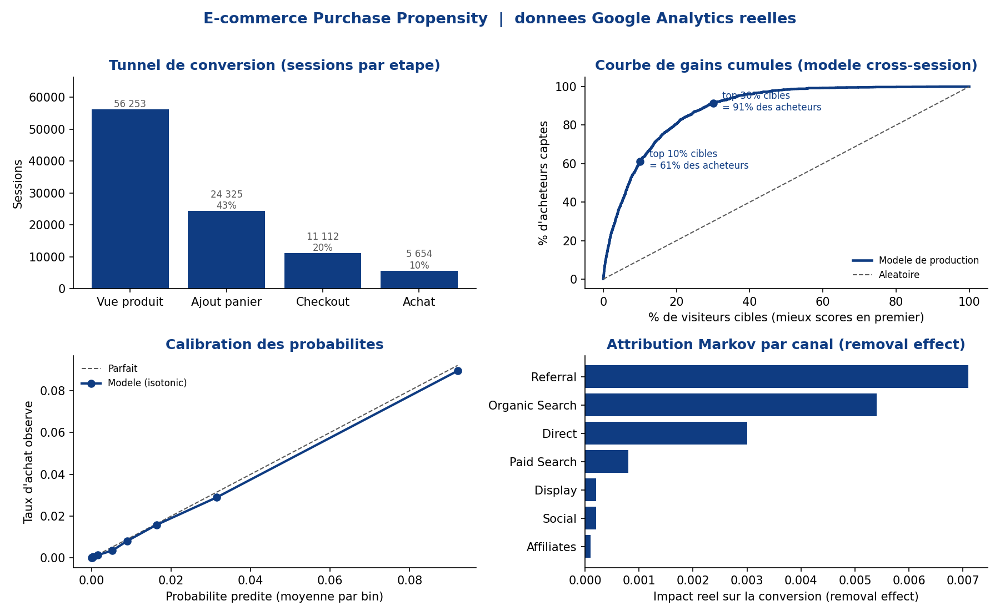

# E-commerce Purchase Propensity

> Prédire quels visiteurs d'un site vont acheter, à partir de leur parcours de navigation, et
> expliquer **pourquoi**. Scoring de propension d'achat, modélisation de séquence du clickstream et
> attribution des canaux sur des données Google Analytics, le tout livré comme un service de
> production (CLI, API, dashboard, tests, CI).

[](https://ecommerce-purchase-propensity-jch32sxxye7yp4wurctwwm.streamlit.app/)


**Démo en ligne :** https://ecommerce-purchase-propensity-jch32sxxye7yp4wurctwwm.streamlit.app/



## Aperçu

Les équipes e-commerce veulent savoir, le plus tôt possible, si un visiteur va convertir, pour le
prioriser, personnaliser son expérience et dépenser le budget marketing là où il rapporte. Ce projet
transforme des sessions **Google Analytics** brutes (le jeu public GA sur BigQuery) en :

1. un **parcours client** reconstitué (clickstream ordonné, hit par hit) ;
2. un **tunnel de conversion** (vue produit, panier, checkout, achat) ;
3. des **scores de propension d'achat** via trois modèles complémentaires, **sans fuite de données** ;
4. une **attribution des canaux** (quels points de contact génèrent vraiment les conversions) ;
5. une **API** et un **dashboard** pour servir et explorer les scores.

Toute la chaîne tourne soit sur les vraies données BigQuery, soit sur un **générateur synthétique**
intégré (aucun compte cloud requis), ce qu'utilisent aussi les tests et la CI.

## Architecture

```text
Sources
  Google Analytics (BigQuery)
  Générateur synthétique
       |
  Feature engineering (contexte, historique visiteur, séquences ordonnées)
       |
  Modèles de propension (sans fuite)
    in-session          : signaux des premiers hits de la visite
    cross-session       : historique des visites passées   [modèle de production]
    séquence (GRU)      : clickstream ordonné
  Attribution Markov    : impact réel de chaque canal
       |
  Évaluation (CV temporelle, calibration, seuil coût/gain)
       |
  Service
    API FastAPI (/score)
    Dashboard Streamlit
```

## Points forts

Trois modèles de propension, conçus pour éviter la fuite de données :

* `in-session` : signaux des premiers hits de la visite (fenêtre pré-intention) ;
* `cross-session` : historique des visites passées du visiteur (le modèle de production) ;
* `séquence` : un GRU sur le parcours ordonné des pages, qui capte les schémas de navigation.

Le reste de la chaîne :

* **Attribution Markov** (removal effect) pour classer les canaux par impact réel ;
* **Rigueur data science** : validation croisée temporelle, calibration des probabilités (isotonic),
  seuil de décision coût/gain, test anti-fuite automatisé, tuning Optuna, suivi MLflow ;
* **Ingénierie de production** : API FastAPI, dashboard Streamlit (avec simulateur de profit
  interactif), Docker et docker-compose, suite pytest, CI GitHub Actions, linting ruff.

## Résultats (données GA réelles)

Google Merchandise Store, fenêtre **février à juillet 2017** (402 566 sessions). Évaluation par
**split temporel** : entraînement sur février-mai, test sur juin-juillet (137 946 sessions, taux de
base **1,46 pour cent**). Reproductible en une commande (voir plus bas).

| Modèle | Signal utilisé | ROC-AUC (test) | CV temporelle | Acheteurs captés (1er décile) |
|--------|----------------|:--------------:|:-------------:|:-----------------------------:|
| in-session | premiers hits de la visite | 0,943 \* | 0,943 ±0,004 | 79,5 pour cent |
| **cross-session (production)** | **historique des visites** | **0,892** | **0,891 ±0,008** | **61,1 pour cent** |
| séquence (GRU) | clickstream ordonné, tronqué avant l'intention | 0,803 | — | 46,4 pour cent |

En ciblant les **30 pour cent** de visiteurs les mieux scorés, le modèle de production capte
**91 pour cent** des acheteurs, soit un lift de **3 fois** l'aléatoire. Les probabilités sont
calibrées (isotonic, voir la courbe de fiabilité ci-dessus) et le seuil de ciblage est fixé par une
fonction coût/gain, pas par un F1. L'attribution Markov classe **Referral** et **Organic Search**
comme les canaux à plus fort impact réel sur ces données.

\* Le score in-session élevé vient en partie de l'engagement des premiers hits (un visiteur qui
rebondit n'achète jamais), un signal peu actionnable. Le modèle que je déploierais réellement est
**cross-session**, dont les facteurs (géographie, canal d'acquisition, historique) sont connus avant
la visite. La CV temporelle (moyenne et écart-type sur fenêtres glissantes) confirme que ce ne sont
pas des splits chanceux.

## Ce qui distingue ce projet

Obtenir un ROC-AUC de 0,95 sur ces données est facile en laissant fuiter des variables. **Savoir
que ce 0,95 est un mensonge, c'est le métier.** Ce dépôt montre deux traques de fuite et leur
correction :

* les variables d'engagement (`pageviews`, `hits`, `time_on_site`) sont exclues, car mécaniquement
  gonflées par l'achat lui-même ;
* le modèle de séquence tronque chaque parcours au premier signal d'intention (panier, checkout,
  pages de compte ou de confirmation) : une fois la fuite retirée, son ROC-AUC retombe d'environ
  0,95 à **0,80**, le vrai pouvoir prédictif du seul ordre des pages.

Détecter puis supprimer la fuite, et livrer le modèle honnête et actionnable, est la compétence
centrale que démontre ce projet. Un test automatisé (`tests/test_rigor.py`) verrouille cette
garantie : il échoue si une variable d'engagement ou une page post-intention réapparaît dans les
features.

Côté métier, le dashboard intègre un **simulateur de profit** : on règle la valeur d'un acheteur et
le coût d'une action, et il calcule combien de trafic cibler pour maximiser le gain net (par exemple,
cibler 10 pour cent du trafic capte 61 pour cent des acheteurs). Le score devient une décision, pas
une métrique abstraite.

## Démarrage rapide

```bash
pip install -r requirements.txt

python -m src.pipeline train --source synthetic   # entrainement sur donnees synthetiques (sans cloud)
pytest tests -q                                    # suite de tests
ruff check src tests                               # linting
uvicorn src.api:app --reload                       # API de scoring
streamlit run app/dashboard.py                     # dashboard
docker compose up --build                          # API et dashboard ensemble
```

Sur les vraies données Google Analytics (projet Google Cloud gratuit) :

```bash
python -m src.pipeline train --source bigquery --project VOTRE_PROJET_GCP \
       --date-min 20170201 --date-max 20170801 --split-date 20170601

# figures du run reel (funnel, gains, calibration, attribution)
python scripts/make_figures.py --project VOTRE_PROJET_GCP \
       --date-min 20170201 --date-max 20170801 --split-date 20170601
```

## Structure du projet

```text
src/        data, features, model, sequence_model (GRU), evaluate, attribution,
            validation (CV temporelle), business (cout/gain), tuning (Optuna), pipeline, api
app/        dashboard.py (Streamlit)
sql/        requetes BigQuery (sessions, clickstream ordonne)
scripts/    make_figures.py (figures du run reel)
figures/    figures generees (funnel, gains, calibration, attribution, overview)
tests/      pytest (donnees, fuite, API, rigueur)
models/     artefacts entraines et metrics.json
racine      Dockerfile, Dockerfile.dashboard, docker-compose.yml, render.yaml,
            pyproject.toml, pre-commit, Makefile, DEPLOY.md, model_card.md
```

## Déploiement

En local avec `docker compose up`, un dashboard public sur Hugging Face Spaces ou Streamlit Cloud,
et l'API sur Render. Les étapes détaillées sont dans [`DEPLOY.md`](DEPLOY.md), les limites du modèle
dans [`model_card.md`](model_card.md).

## Stack technique

Python, pandas, scikit-learn, LightGBM, PyTorch, Optuna, MLflow, FastAPI, Streamlit, Docker,
BigQuery, pytest, ruff, GitHub Actions.

## Auteur

**Souleymane Diallo**, élève-ingénieur en Intelligence Artificielle et Data Science.
[GitHub](https://github.com/SouleymaneDiallo04) | [Portfolio](https://jeuf-tech-portfolio.vercel.app/)
